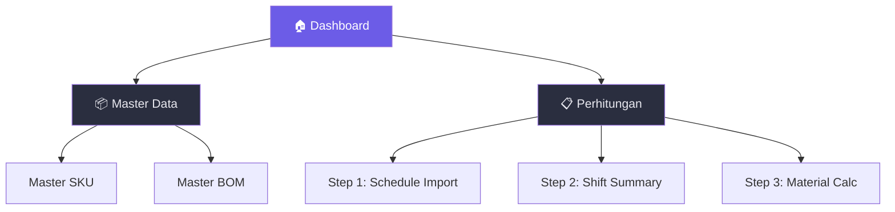
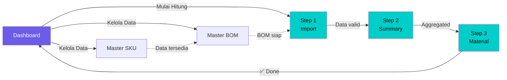

# Packaging Material Calculator (PMC) — Frontend UI/UX Plan

Merancang antarmuka modern, responsif, dan intuitif untuk aplikasi PMC yang mengonversi rencana produksi mingguan menjadi kebutuhan riil bahan pengemas per shift.

## Teknologi

| Layer | Choice |
|---|---|
| Bundler | **Vite** (vanilla JS, no framework) |
| Styling | **Vanilla CSS** (custom properties / design tokens) |
| Icons | **Lucide Icons** (via CDN) |
| Fonts | **Inter** (Google Fonts) |
| Charts | **Chart.js** (lightweight) |
| Excel I/O | **SheetJS (xlsx)** |

---

## Design System

### Color Palette (Dark Mode First)

| Token | Value | Usage |
|---|---|---|
| `--bg-primary` | `#0f1117` | Body / main background |
| `--bg-surface` | `#1a1d27` | Cards, panels |
| `--bg-surface-2` | `#242837` | Sidebar, elevated panels |
| `--bg-hover` | `#2a2e3f` | Hover states |
| `--accent` | `#6c5ce7` | Primary accent (purple) |
| `--accent-glow` | `rgba(108,92,231,0.25)` | Glow/shadow effects |
| `--success` | `#00cec9` | Positive indicators |
| `--warning` | `#fdcb6e` | Warnings, alerts |
| `--danger` | `#ff7675` | Errors, destructive |
| `--text-primary` | `#e8e8ef` | Main text |
| `--text-secondary` | `#8b8fa3` | Muted text |
| `--border` | `rgba(255,255,255,0.06)` | Subtle borders |
| `--glass` | `rgba(26,29,39,0.7)` | Glassmorphism panels |

### Typography

```
Font: "Inter", sans-serif
H1: 1.75rem / 700  — Page titles
H2: 1.25rem / 600  — Section headers
H3: 1rem   / 600  — Card titles
Body: 0.875rem / 400
Small: 0.75rem / 400 — Labels, captions
```

### Spacing & Radius

```
--space-xs: 4px    --radius-sm: 6px
--space-sm: 8px    --radius-md: 10px
--space-md: 16px   --radius-lg: 16px
--space-lg: 24px   --radius-xl: 20px
--space-xl: 32px   --radius-full: 9999px
```

---

## Navigation & Routing

### Sitemap



### Routing (Hash-based SPA)

| Route | Page |
|---|---|
| `#/` | Dashboard Overview |
| `#/master/sku` | Master SKU |
| `#/master/bom` | Master BOM |
| `#/schedule` | Step 1 — Schedule Import |
| `#/summary` | Step 2 — Shift Summary |
| `#/materials` | Step 3 — Material Requirement |

---

## Layout Structure

```
┌──────────────────────────────────────────────────────┐
│  SIDEBAR (240px, fixed)  │  MAIN CONTENT AREA        │
│                          │                            │
│  ┌──────────────────┐    │  ┌──────────────────────┐  │
│  │ 📦 PMC Logo      │    │  │ TOP BAR              │  │
│  ├──────────────────┤    │  │ Page Title + Actions  │  │
│  │ 🏠 Dashboard     │    │  └──────────────────────┘  │
│  ├──────────────────┤    │                            │
│  │ 📁 Master Data ▾ │    │  ┌──────────────────────┐  │
│  │   ├─ Master SKU  │    │  │                      │  │
│  │   └─ Master BOM  │    │  │   PAGE CONTENT       │  │
│  ├──────────────────┤    │  │   (scrollable)        │  │
│  │ 📋 Perhitungan ▾ │    │  │                      │  │
│  │   ├─ Schedule    │    │  │                      │  │
│  │   ├─ Summary     │    │  └──────────────────────┘  │
│  │   └─ Material    │    │                            │
│  ├──────────────────┤    │                            │
│  │                  │    │                            │
│  │  [Collapse ‹]    │    │                            │
│  └──────────────────┘    │                            │
└──────────────────────────────────────────────────────┘
```

- Sidebar collapsible ke icon-only (64px) di layar kecil
- Mobile: Sidebar menjadi drawer overlay

---

## Page Wireframes

### 1. Dashboard Overview (`#/`)

```
┌─────────────────────────────────────────────────────┐
│ 📊 Dashboard Overview                     [W12 2026]│
├─────────────────────────────────────────────────────┤
│                                                     │
│  ┌──────────┐ ┌──────────┐ ┌──────────┐ ┌────────┐ │
│  │ Total SKU│ │Total BOM │ │Prod.Week │ │Pending │ │
│  │   126    │ │   483    │ │12,400 Box│ │ 3 SKU  │ │
│  │ +3 baru  │ │ aktif    │ │ target   │ │ belum  │ │
│  └──────────┘ └──────────┘ └──────────┘ └────────┘ │
│                                                     │
│  ┌─────────────────────────┐ ┌───────────────────┐  │
│  │ 📈 Tren Produksi (7d)   │ │ 🏭 Produksi/Shift │  │
│  │ ▓▓▓▓▓▓▓▓░░ Chart.js    │ │ SH1: ████ 4200   │  │
│  │ Line chart per hari     │ │ SH2: ███░ 3800   │  │
│  │                         │ │ SH3: ██░░ 3200   │  │
│  └─────────────────────────┘ └───────────────────┘  │
│                                                     │
│  ┌─────────────────────────────────────────────────┐ │
│  │ 📋 Jadwal Terbaru                    [Lihat →] │ │
│  │ ┌─────────┬──────────┬─────────┬──────────────┐│ │
│  │ │ Tanggal │ Total SKU│ Total   │ Status       ││ │
│  │ │ 10 Mar  │ 12       │ 4,200   │ ✅ Converted ││ │
│  │ │ 11 Mar  │ 15       │ 5,100   │ ⏳ Pending   ││ │
│  │ └─────────┴──────────┴─────────┴──────────────┘│ │
│  └─────────────────────────────────────────────────┘ │
└─────────────────────────────────────────────────────┘
```

**Komponen:** StatCards (4), LineChart, BarChart (shift), RecentTable

---

### 2. Master SKU (`#/master/sku`)

```
┌─────────────────────────────────────────────────────┐
│ 📦 Master SKU                     [+ Tambah SKU]   │
├─────────────────────────────────────────────────────┤
│ 🔍 [Search SKU...        ] [Filter: UOM ▾] [Semua] │
│                                                     │
│  ┌─────────────────────────────────────────────────┐ │
│  │ Oracle Code │ Nama SKU            │ UOM │ Aksi  │ │
│  ├─────────────┼─────────────────────┼─────┼───────┤ │
│  │ SKU001      │ ABC Mocca 250g      │ BOX │ ✏️ 🗑│ │
│  │ SKU002      │ ABC Susu 180g       │ BOX │ ✏️ 🗑│ │
│  │ SKU003      │ XYZ Cappuccino 500g │ BOX │ ✏️ 🗑│ │
│  └─────────────┴─────────────────────┴─────┴───────┘ │
│                                                     │
│  ┌────────────────────────────────────┐              │
│  │ Konversi Satuan (UOM Mapping)      │              │
│  │ ┌────────┬──────────┬────────────┐ │              │
│  │ │ UOM    │ Satuan   │ Konversi   │ │              │
│  │ │ ROL    │ 1 Roll   │ 1000 meter │ │              │
│  │ │ PCS    │ 1 Pieces │ -          │ │              │
│  │ └────────┴──────────┴────────────┘ │              │
│  └────────────────────────────────────┘              │
│                                                     │
│  [‹ 1 2 3 ... 10 ›]                                │
└─────────────────────────────────────────────────────┘
```

**Komponen:** SearchBar, FilterDropdown, DataTable (sortable), Pagination, Modal (Add/Edit SKU), UOM Conversion table

---

### 3. Master BOM (`#/master/bom`)

```
┌─────────────────────────────────────────────────────┐
│ 🧾 Master BOM (Bill of Material)   [+ Tambah BOM]  │
├─────────────────────────────────────────────────────┤
│ 🔍 [Search SKU / Komponen...    ]                   │
│                                                     │
│  ┌─────────────────────────────────────────────────┐ │
│  │ ▼ SKU001 — ABC Mocca 250g                       │ │
│  │  ┌───────────────┬──────────┬────┬────────────┐ │ │
│  │  │ Komponen      │ Koefisien│ UOM│ Pembulatan │ │ │
│  │  ├───────────────┼──────────┼────┼────────────┤ │ │
│  │  │ Karton Mocca   │ 1.0000  │PCS │ ⬆ Ceiling  │ │ │
│  │  │ Plastik Mocca  │ 0.01389 │ROL │ 4 desimal  │ │ │
│  │  │ OPP Warna      │ 0.00222 │ROL │ 4 desimal  │ │ │
│  │  │ Label Mocca    │ 1.0000  │PCS │ ⬆ Ceiling  │ │ │
│  │  └───────────────┴──────────┴────┴────────────┘ │ │
│  │                          [+ Tambah Komponen]    │ │
│  ├─────────────────────────────────────────────────┤ │
│  │ ▶ SKU002 — ABC Susu 180g           (4 komponen)│ │
│  │ ▶ SKU003 — XYZ Cappuccino 500g     (3 komponen)│ │
│  └─────────────────────────────────────────────────┘ │
└─────────────────────────────────────────────────────┘
```

**Komponen:** Accordion/Collapsible per SKU, DataTable (inner), RoundingSelector, Modal (Add/Edit Component)

> [!TIP]
> BOM menggunakan **accordion pattern** agar user bisa fokus pada satu SKU tanpa kehilangan overview SKU lain.

---

### 4. Step 1 — Schedule Import (`#/schedule`)

```
┌──────────────────────────────────────────────────────┐
│ 📋 Step 1: Smart Schedule Importer                   │
├──────────────────────────────────────────────────────┤
│                                                      │
│  ┌────────────────────────────────────────────────┐   │
│  │         📁 Drop Excel file here                │   │
│  │         or [Browse File]                       │   │
│  │                                                │   │
│  │  Supported: .xlsx, .xls                        │   │
│  └────────────────────────────────────────────────┘   │
│                                                      │
│  ── Atau Input Manual ──                             │
│  Tanggal: [📅 2026-03-10]  Line: [Line 1 ▾]         │
│                                                      │
│  ⚠️ Validation Alerts:                               │
│  ┌────────────────────────────────────────────────┐   │
│  │ ❌ SKU "XYZ999" tidak ditemukan di Master Data │   │
│  │ ⚠️ Kolom target kosong di Row 15               │   │
│  │ ⚠️ Format tanggal tidak valid di Row 22        │   │
│  └────────────────────────────────────────────────┘   │
│                                                      │
│  📊 Mapping Table Preview:                           │
│  ┌──────────┬────────┬───────────────────────────┐   │
│  │ Line     │ SKU    │ SH1  │  SH2  │  SH3      │   │
│  ├──────────┼────────┼──────┼───────┼───────────┤   │
│  │ Line 1   │ SKU001 │  400 │  350  │  250      │   │
│  │ Line 1   │ SKU002 │  200 │  300  │  200      │   │
│  │ Line 2   │ SKU001 │  150 │  200  │  150      │   │
│  └──────────┴────────┴──────┴───────┴───────────┘   │
│                                                      │
│  [Simpan & Lanjut ke Step 2 →]                       │
└──────────────────────────────────────────────────────┘
```

**Komponen:** DragDropZone, FileInput, DatePicker, ValidationAlerts, EditableTable, NavigateButton

---

### 5. Step 2 — Shift Summary (`#/summary`)

```
┌──────────────────────────────────────────────────────┐
│ 📊 Step 2: Shift-Production Summary    [⬇ Export]   │
├──────────────────────────────────────────────────────┤
│ Tanggal: [📅 10 Mar ▾]  Filter: [Semua SKU ▾]       │
│                                                      │
│  ┌──────────┐  ┌──────────┐  ┌──────────┐           │
│  │ 🟢 SH1   │  │ 🔵 SH2   │  │ 🟣 SH3   │           │
│  │ 4,200 Box│  │ 3,800 Box│  │ 3,200 Box│           │
│  └──────────┘  └──────────┘  └──────────┘           │
│                              Total: 11,200 Box       │
│                                                      │
│  ┌──────────────────────────────────────────────────┐ │
│  │ SKU          │ SH1   │ SH2   │ SH3   │ Total    │ │
│  ├──────────────┼───────┼───────┼───────┼──────────┤ │
│  │ ABC Mocca    │ 550   │ 550   │ 400   │ 1,500    │ │
│  │ ABC Susu     │ 400   │ 500   │ 300   │ 1,200    │ │
│  │ XYZ Cappu    │ 300   │ 200   │ 250   │   750    │ │
│  ├──────────────┼───────┼───────┼───────┼──────────┤ │
│  │ GRAND TOTAL  │4,200  │3,800  │3,200  │ 11,200   │ │
│  └──────────────┴───────┴───────┴───────┴──────────┘ │
│                                                      │
│  [← Kembali]                  [Lanjut ke Step 3 →]  │
└──────────────────────────────────────────────────────┘
```

**Komponen:** ShiftCards (3), AggregatedTable, DateFilter, ExportButton

---

### 6. Step 3 — Material Requirement (`#/materials`)

```
┌──────────────────────────────────────────────────────┐
│ 🏭 Step 3: Material Requirement        [⬇ Export]   │
├──────────────────────────────────────────────────────┤
│ Tanggal: [📅 10 Mar ▾]  View: [Per SKU ▾ | Grouped] │
│                                                      │
│  ── Warehouse Picklist (Grouped) ──                  │
│  ┌──────────────────────────────────────────────────┐ │
│  │ Material      │ SH1    │ SH2    │ SH3    │Total │ │
│  ├───────────────┼────────┼────────┼────────┼──────┤ │
│  │ Karton Mocca   │ 550   │ 550    │ 400    │1,500 │ │
│  │ Karton Susu    │ 400   │ 500    │ 300    │1,200 │ │
│  │ Plastik Mocca  │ 7.64  │ 7.64   │ 5.56   │20.84 │ │
│  │ OPP Warna      │ 1.22  │ 1.22   │ 0.89   │ 3.33 │ │
│  └───────────────┴────────┴────────┴────────┴──────┘ │
│                                                      │
│  ── Detail Per SKU ──                                │
│  ▼ ABC Mocca (550 box SH1 / 550 SH2 / 400 SH3)     │
│  ┌───────────────┬────────┬──────┬──────┬──────────┐ │
│  │ Komponen      │Rumus   │ SH1  │ SH2  │ Total    │ │
│  ├───────────────┼────────┼──────┼──────┼──────────┤ │
│  │ Karton        │ ×1     │ 550  │ 550  │ 1,500 PCS│ │
│  │ Plastik       │ ×0.0139│ 7.64 │ 7.64 │ 20.84ROL │ │
│  └───────────────┴────────┴──────┴──────┴──────────┘ │
│                                                      │
│  [← Kembali]                  [✅ Tandai Selesai]    │
└──────────────────────────────────────────────────────┘
```

**Komponen:** ViewToggle (Grouped/PerSKU), PicklistTable, DetailAccordion, StatusButton

---

## User Flow



---

## Interaction & Animation Details

| Element | Animation |
|---|---|
| Page transitions | Fade-in 200ms + slide-up 8px |
| Sidebar hover | Background ease 150ms |
| Cards | `transform: scale(1.02)` on hover |
| Modals | Backdrop fade + scale-in from 0.95 |
| Tables | Row highlight on hover with left accent |
| Buttons | Subtle gradient shift on hover |
| Alerts (Validation) | Slide-in from right, 300ms |
| Stat numbers | Count-up animation on load |

---

## Responsive Breakpoints

| Breakpoint | Behavior |
|---|---|
| `≥1200px` | Full sidebar (240px) + content |
| `768–1199px` | Collapsed sidebar (64px, icons only) |
| `<768px` | Sidebar hidden, hamburger menu → drawer overlay |

---

## Proposed File Structure

```
jit 2/
├── index.html
├── package.json
├── vite.config.js
├── public/
│   └── favicon.svg
└── src/
    ├── main.js              ← Entry point + Router
    ├── router.js            ← Hash-based SPA router
    ├── store.js             ← Global state (in-memory)
    ├── styles/
    │   ├── index.css        ← Design tokens + reset
    │   ├── layout.css       ← Sidebar, topbar, grid
    │   ├── components.css   ← Buttons, cards, tables, modals
    │   └── pages.css        ← Page-specific styles
    ├── components/
    │   ├── sidebar.js
    │   ├── topbar.js
    │   ├── stat-card.js
    │   ├── data-table.js
    │   ├── modal.js
    │   ├── drag-drop.js
    │   ├── pagination.js
    │   ├── toast.js
    │   └── chart-wrapper.js
    └── pages/
        ├── dashboard.js
        ├── master-sku.js
        ├── master-bom.js
        ├── schedule-import.js
        ├── shift-summary.js
        └── material-calc.js
```

---

## Proposed Changes

### Project Setup

#### [NEW] [package.json](file:///c:/Users/54321/Desktop/jit%202/package.json)
Vite project config with dependencies: `vite`, `xlsx` (SheetJS), `chart.js`

#### [NEW] [vite.config.js](file:///c:/Users/54321/Desktop/jit%202/vite.config.js)
Basic Vite config for vanilla JS project

#### [NEW] [index.html](file:///c:/Users/54321/Desktop/jit%202/index.html)
Root HTML with Google Fonts (Inter), Lucide Icons CDN, Chart.js CDN, app container

---

### Design System

#### [NEW] [index.css](file:///c:/Users/54321/Desktop/jit%202/src/styles/index.css)
CSS custom properties, reset, typography, dark mode tokens

#### [NEW] [layout.css](file:///c:/Users/54321/Desktop/jit%202/src/styles/layout.css)
Sidebar, topbar, main content grid, responsive breakpoints

#### [NEW] [components.css](file:///c:/Users/54321/Desktop/jit%202/src/styles/components.css)
Reusable component styles: buttons, cards, tables, modals, dropdowns, alerts, animations

#### [NEW] [pages.css](file:///c:/Users/54321/Desktop/jit%202/src/styles/pages.css)
Page-specific overrides and layouts

---

### Core Logic

#### [NEW] [main.js](file:///c:/Users/54321/Desktop/jit%202/src/main.js)
App entry: init router, render sidebar + topbar, mount initial page

#### [NEW] [router.js](file:///c:/Users/54321/Desktop/jit%202/src/router.js)
Hash-based SPA router with page transitions (fade + slide)

#### [NEW] [store.js](file:///c:/Users/54321/Desktop/jit%202/src/store.js)
In-memory global state for SKU list, BOM data, schedules, calculations. Event-based reactivity for dynamic updates

---

### Components (All New)

Each component exports a render function returning DOM elements:

- **sidebar.js** — Collapsible sidebar, active state, submenu accordion
- **topbar.js** — Page title, breadcrumb, action buttons
- **stat-card.js** — Animated number card with icon and subtitle
- **data-table.js** — Sortable, searchable table with pagination
- **modal.js** — Reusable modal with backdrop, scale-in animation
- **drag-drop.js** — File upload zone with drag-and-drop + browse
- **pagination.js** — Page navigation component
- **toast.js** — Toast notification system (success/error/warning)
- **chart-wrapper.js** — Chart.js wrapper for line and bar charts

---

### Pages (All New)

- **dashboard.js** — 4 stat cards, production trend chart, shift bar chart, recent schedules table
- **master-sku.js** — CRUD table for SKU + UOM conversion table
- **master-bom.js** — Accordion BOM editor per SKU with rounding config
- **schedule-import.js** — Drag-drop Excel upload, validation alerts, editable mapping table
- **shift-summary.js** — Aggregated shift cards + summary table, export to Excel
- **material-calc.js** — Warehouse picklist (grouped), per-SKU detail accordion, real-time recalculation

---

## Verification Plan

### Browser Testing
1. Run `npm run dev` in the project directory
2. Open the local dev URL in browser
3. Verify each page renders correctly:
   - Dashboard shows stat cards and chart placeholders
   - Master SKU shows data table with search/filter
   - Master BOM shows accordion layout
   - Schedule Import shows drag-drop zone and editable table
   - Shift Summary shows shift cards and aggregated table
   - Material Calc shows grouped picklist and per-SKU detail
4. Test navigation between all pages
5. Test sidebar collapse/expand
6. Test responsive behavior at different viewport widths
7. Test modal open/close on Master SKU and BOM pages

### Manual Verification
- User reviews the UI in browser and provides feedback on:
  - Color scheme and dark mode readability
  - Navigation flow intuitiveness
  - Table layouts and data presentation
  - Animation smoothness
  - Responsive behavior on their device
