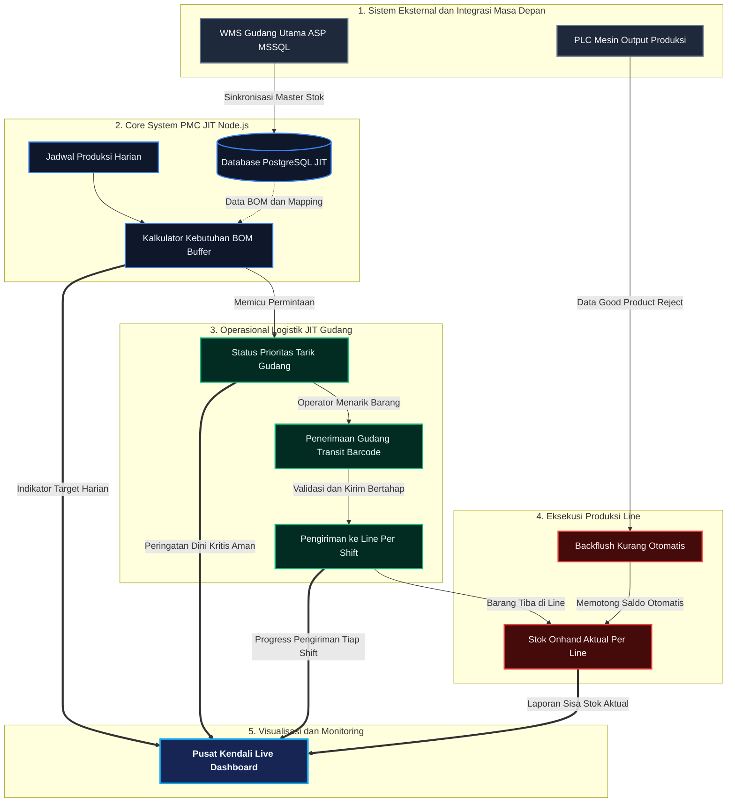

# Presentasi Sistem PMC JIT (Just-In-Time) terintegrasi

Dokumen ini disusun sebagai bahan presentasi kepada manajemen/atasan mengenai arsitektur, alur kerja operasional, dan keunggulan ekosistem PMC JIT yang telah dibangun (termasuk potensi integrasi PLC dan WMS).

---

## 1. Arsitektur & Alur Kerja Sistem (End-to-End Flowchart)

Berikut adalah diagram alur bagaimana material bergerak dari Gudang Utama hingga dikonsumsi oleh Mesin, dan bagaimana data mengalir secara *real-time* ke Dashboard Pusat Kendali.



---

## 2. Penjelasan Tahapan Alur (Untuk Dipresentasikan)

Untuk melengkapi presentasi ke atasan, Anda dapat memaparkan narasi operasional dari diagram di atas menjadi **5 Fase Utama**:

### Fase 1: Integrasi Master Data (Eksternal)
Sistem JIT kita didesain untuk tidak bekerja sendirian secara manual. _Database_ inti JIT (PostgreSQL) dapat diintegrasikan dengan sistem **WMS ASP eksisting** perusahaan untuk menarik data ketersediaan *"Stock On-hand"* Gudang Utama tanpa merombak sistem lama. Di ujung lainnya, **PLC Mesin** juga dihubungkan untuk mengirimkan tanda *"Selesai Produksi"* secara live.

### Fase 2: Kalkulator Cerdas PMC JIT
Ketika _Planner_ memasukkan Jadwal Produksi hari itu (Shift 1, 2, 3), sistem JIT langsung mengalikan dengan struktur **BOM (Bill of Materials)** tiap SKU. Mesin kalkulator akan memecah total lembaran material yang dibutuhkan dalam satu hari menjadi ukuran **"Buffer Aman 2 Jam"**. 

### Fase 3: Logistik & Gudang Transit (Pencegahan Tumpukan)
Tanpa JIT, material biasanya dikirimkan sekaligus ke ruang mesin, membuat area line menjadi kepenuhan dan rentan *reject* tumpukan. Di sistem ini:
1. Layar gudang hanya akan berbunyi merah (Status **KRITIS**) jika stok *Transit* untuk 2-jam ke depan hampir habis.
2. Saat barang dipindahkan dari Gudang Utama ke Transit, operator melakukan pemindaian **Barcode**. 
3. Pengiriman dari Transit ke _Line_ dipandu secara cerdas dalam jadwal *Slot/Kloter (contoh: Grup pengiriman 07:30 - 08:30)*.

### Fase 4: Pengurangan Stok Line Otomatis (Backflushing)
Barang yang sudah diterima oleh sistem Line (via verifikasi Barcode), secara resmi menjadi **Onhand Line**. Fitur masa depan integrasi PLC akan menghitung berapa box Kopi yang selesai dan berapa material kemasan yang *reject*. Secara magis, jumlah ini memotong stok *Onhand Line* secara **Otomatis (Backflush)**. Menghilangkan pelaporan _stock opname_ kertas harian yang rawan *human-error*.

### Fase 5: Pusat Kendali (Live Dashboard) 🖥️
Seluruh aktivitas di atas dimonitor oleh atasan / manajer secara _Real-Time_ dalam bentuk grafis "Command Center". Semua indikator kemajuan (pengiriman shift, sisa stok per jam, tren penyelesaian) ditampilkan dalam layar yang responsif dan canggih bak sistem pabrik modern kelas dunia.

---

## 3. Panduan Menjalankan Sistem (Demo ke Atasan)

Sistem JIT ini sudah dipaketkan menggunakan **Docker** sehingga sangat tangguh, tersentralisasi, bebas dari error instalasi komputer yang berbeda-beda, dan bisa dijalankan dengan sekali klik.

### A. Persiapan Infrastruktur Demontrasi
1. Pastikan aplikasi **Docker Desktop** sudah berjalan di komputer / server Windows Anda.
2. Buka aplikasi **PowerShell** atau **Terminal CMD**.
3. Arahkan *folder* sistem ke lokasi direktori *project* JIT 2 kita:
   ```cmd
   cd "C:\Users\54321\Desktop\jit 2"
   ```

### B. Menyalakan Sistem JIT End-to-End
Jalankan satu baris perintah di bawah ini untuk menyalakan Frontend (Layar UI), Backend (Logika API Server), dan Engine Database secara serentak di belakang layar:
```cmd
docker compose up -d --build
```
> *(Tunggu beberapa saat hingga muncul notifikasi "Started" untuk kontainer `jit2-web`, `jit2-api`, dan `pmc-postgres`)*

### C. Menampilkan ke Layar Presentasi / Boss
Aplikasi kini siap didemostrasikan:
1. Buka Browser (Chrome / Edge).
2. Tampilkan Layar Utama dengan mengakses: **[http://localhost:5137](http://localhost:5137)**
3. Untuk presentasi fungsional, tunjukkan halaman **Pusat Kendali JIT** (Dashboard Real-Time) yang menunjukkan animasi jam interaktif, status suplai Shift saat ini, hingga tabel Produksi.
4. Tunjukkan modul **Warehouse Delivery** maupun **Schedules** untuk menjelaskan bahwa seluruh indikator yang berjalan di Dashboard itu digerakkan langsung dari transaksi bawah.

### D. Mematikan Sistem
Selesai presentasi, Anda bisa mematikan dan mengamankan jaringan servernya kembali dengan menjalankan:
```cmd
docker compose down
```

> [!TIP]
> **Menjawab Pertanyaan Atasan (Eksekutif)**
> Jika atasan bertanya apakah investasi / program ini akan merusak sistem perusahaan yang sudah ada? Jawab dengan yakin: _"Tidak sama sekali, sistem PMC JIT ini dibangun menggunakan arsitektur **microservice headless**. Kita bertindak seperti pendengar pasif (bridge) ke database WMS ASP lama, serta menggunakan jalur API terpisah untuk PLC, sehingga program pabrik yang lama 100% aman dan tak terganggu."_

---

## 4. Penjelasan Modul & Menu Aplikasi (Struktur UI)

Aplikasi PMC JIT telah dirancang dengan struktur menu yang logis (dari persiapan data hingga eksekusi pengiriman fisik). Berikut adalah menu-menu utama di dalam sistem beserta fungsinya:

### 🌟 Pusat Kendali JIT (Dashboard Utama)
Menu pertama yang terbuka saat aplikasi dimuat. Berfungsi sebagai **Layar Monitoring Ringkasan** harian. Di sini atasan dapat melihat grafik pencapaian harian, indikator bahaya (kritis vs aman), animasi status suplai secara *real-time*, dan rekapitulasi performa per shift secara sekilas tanpa perlu melihat tabel rumit.

### 🗂️ Master Data
Jantung dari aplikasi, menyimpan referensi baku yang menentukan keakuratan perhitungan sistem:
- **Master SKU**: Mengelola daftar produk jadi (Kopi/Minuman) yang diproduksi pabrik.
- **Master BOM (Bill of Materials)**: Merupakan "Resep Masakan". Di sinilah kita mendefinisikan untuk membuat 1 Box SKU Kopi, butuh berapa gram bubuk, berapa lembar karton *layer*, plastik *cup*, lid, box karton, dsb.
- **Master Blok Stok**: Pemetaan rak/lokasi Gudang Transit secara fisik (Misal: Baris A, Kolom B) untuk kemudahan inspeksi visual.
- **Line per SKU**: Mengikat produk jadi tertentu supaya secara paten hanya bisa diproduksi di mesin/line tertentu (contoh: Kopi ABC Vanilla hanya boleh di Line 3F2).

### 🧮 Perhitungan (Kalkulator Kebutuhan)
Modul untuk **Perencanaan (Planning)** oleh PPIC:
- **Kebutuhan per Shift**: Dengan menginput jadwal target box per shift (Misal: Shift 1 target 4,000 Box), kalkulator ini secara otomatis membedah target tersebut menjadi ribuan lembar material kemasan dalam hitungan detik. Mengurangi hitungan manual yang rawan salah.
- **SPB Harian**: Digunakan untuk mencetak Laporan Surat Permintaan Barang harian guna diserahkan dari gudang Transit kepada pihak Logistik Utama.

### 📥 Transit Inbound
Mengawal pergerakan barang yang *masuk* dari Gudang Utama ke Gudang Transit (Lantai Pabrik):
- **Penerimaan Gudang**: Mencatat barang masuk secara fisik sebagai penambah *Stock On-hand*.
- **Stock On-Hand Aktual**: Daftar *live* sisa persediaan material yang saat ini berada di lantai pabrik siap diantar ke mesin.
- **Laporan Mutasi**: Merekam rekam jejak setiap pergerakan yang terjadi (seperti buku tabungan material).

### 📤 Transit Outbound (Distribusi ke Line)
Modul eksekusi logistik untuk pekerja lapangan (Mencegah tumpukan material berlebih di line):
- **Pindai Pengiriman (Barcode Scanner)**: Pekerja gudang menggunakan alat pemindai kabel untuk merekam palet/kotak material fisik ke dalam sistem sesaat sebelum ditarik ke dalam line produksi.
- **Status Pengiriman Line**: Menu tabel utama pengiriman material aktual ke *line*.

---

## 5. Konsep "Tampilan Per Group" (Time Slot Delivery) ⏱️

Salah satu invoasi utama sistem ini adalah metode **Tarik Bertahap** atau **Time Slot Grouping**. Sistem memecah 1 Shift penuh (8 Jam) menjadi 4-5 tahap pengiriman guna menjamin mesin tidak kebanjiran material dan lorong pabrik tetap bersih.

**Bagaimana Tampilan Detail Per Grup Bekerja?**
1. **Navigasi Tab per Shift**: Di atas tabel pengiriman, terdapat tombol tab (Shift 1, Shift 2, Shift 3). Ketika Shift 1 dipilih, sistem langsung mengaktifkan _Timeline_ slot waktu shift tersebut.
2. **Timeline 4 Grup (Kloter)**: Jadwal distribusi Shift 1 dipecah secara visual menjadi Grup 1 (07:30 - 08:30), Grup 2 (09:00 - 10:00), dst.
3. **Indikator Aktif (Warna Menyala)**: Sistem akan otomatis mengenali jam berapa saat ini. Jika sekarang jam 08:00 pagi, maka kotak *Grup 1* akan menyala terang dengan tulisan **"SEDANG BERJALAN"**, sedangkan Grup 2 dst masih *"Menunggu"*.
4. **Detail Material Per Slot**: Ketika sebuah Grup sedang berjalan, tabel di bawahnya (Tampilan Detail) merangkum _hanya jumlah suplai_ yang harus diantarkan pada rentang 1 hingga 2 jam tersebut.
5. **Persentase Progress Otomatis**: Ketika _Scanner_ (di menu Pindai Pengiriman) menembak barcode material, tabel detail di grup yang aktif ini akan terisi pelan-pelan (Target vs Aktual) dari 0% hingga 100%.

> *"Dengan membedah total harian menjadi Tampilan Target Per Grup 1 hingga 2 Jam sekali, petugas gudang menjadi jauh lebih fokus, area produksi tetap tertata rapi sesuai standar 5S, dan Just-In-Time benar-benar tercapai."*

---

## 6. Alur Operasional Harian Lapangan (A-Z) 🔄

Sistem kami dirancang bukan hanya hebat secara layar, tapi juga memandu perilaku kerja harian secara mulus dari _Office_ (PPIC) hingga ke Lantai Mesin (_Line_). Berikut adalah siklus kerjanya:

### 1️⃣ **PPIC Menyusun Jadwal & SPB (Surat Permintaan Barang)**
Pada awal shift (atau H-1), tim PPIC membuka modul **SPB Harian** di aplikasi. Berbeda dengan cara lama yang butuh berjam-jam berkutat di Excel, PPIC kini cukup mengunduh dokumen Excel otomatis per Line. Aplikasi telah memecah target Karton (Kopi) menjadi tabel spesifikasi Roll Plastik, Karton Box, Lid, dll, yang valid untuk satu haru penuh berdasarkan *Master BOM*.

### 2️⃣ **Gudang Utama Menaruh Barang ke Transit**
Berbekal *SPB Harian* cetakan sistem, petugas Gudang Utama Forklift menyiapkan palet-palet *packing* tersebut lalu memindahkannya dari rak penyimpanan (Gudang Induk) merapat ke area transisi (Gudang Transit / Lorong Khusus). 
*Di aplikasi, aktivitas pindah ini memunculkan saldo pada halaman **Stock On-Hand Aktual Transit**.*

### 3️⃣ **Petugas Logistik (Transit) Mendistribusikan & Men-Scan**
Sistem *Dashboard* berbunyi dan meminta material! Daripada mengirim seluruh gulungan roll plastik sekaligus, petugas transit hanya melihat layar target di *"Grup Waktu yang Aktif"* (misalnya grup jam 09:00 - 10:00 menagih 3 Roll material A). 
Petugas logistik lalu menyiapkan barang tersebut dan menembakkan **Barcode Gun** (Scanner) *klik*. Sesaat setelah *barcode* dibaca, status aplikasi langsung tercetak sebagai **Terkirim**, dan saldo Gudang Transit akan otomatis berkurang (Outbound).

### 4️⃣ **Anak Helper Roll Line Menerima & Menyiapkan di Mesin**
Palet gulungan plastik dan *carton box* tersebut tiba di *Drop Zone* pinggir Line Mesin. Operator mesin atau Anak *Helper Roll* kemudian hanya perlu menarik persediaan yang memang sangat spesifik diperuntukkan bagi *running* sejam ke depan itu dan memasangnya langsung ke rangka mesin kemasan (*Packaging Line*). Area kaki meja mesin menjadi selalu bersih dari sisa material berserakan, dan stok *Line* saat itu juga dinyatakan terhitung resmi menempel pada modul aplikasi *Line*.
